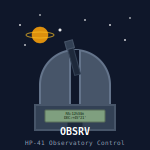

# hp-41_obsrv

## HP-41: Observation logging for the amateur astronomer

This is a full fledged observation logger for amateur astronomers. You add your observation equipment (telescopes, occulars, barlows and filters). You add observation objects/targets (Solar system object, Star, Double Star, Tripple Star, Variable star, Open cluster, Globular, Nebulae, Galaxy). You create your observation agenda/list for the night and then enter your notes for each object you observe. You can create templates as observation list.

This program depends on the AMC_OS/X and PowerCL_Ext modules by Ángel Martin as well as the HEPAX module.

The input function PMTK is used as menu system throughout the program. This makes it possible to choose among many different options such as when adding a new object where "+ S123VOGNX/" as the prompt means Add: Solar system, Star, 2xStar, 3xStar, Variable star, Open cluster, Globular, Nebulae, Galaxy, [up]. The first character(s) is the menu label while the rest of the characters can be pressed for the various objects to be added to a list.

Here is the menus throughout: the program:

Menu	|Description
----------------|-----------
"OBS *O+EaTc/" | (OBS: Observe, Browse objects, Add objects, Browse equipment, add equipment, Template, clear Cur-file)
"? S123VOGNX/" | (Browse: Solar system, Star, 2xStar, 3xStar, Variable star, Open cluster, Globular, Nebulae, Galaxy, [up])
"+ S123VOGNX/" | (Add: Solar system, Star, 2xStar, 3xStar, Variable star, Open cluster, Globular, Nebulae, Galaxy, [up])
"? SEBF/" | (Browse: Scope, Eyepiece, Barlow, Filter)
"+ SEBF/" | (Add: Scope, Eyepiece, Barlow, Filter)

The rest of the program should be fairly self explanatory when using it. Try it out, experiment :-)

## License
This software is released into the Public Domain.
